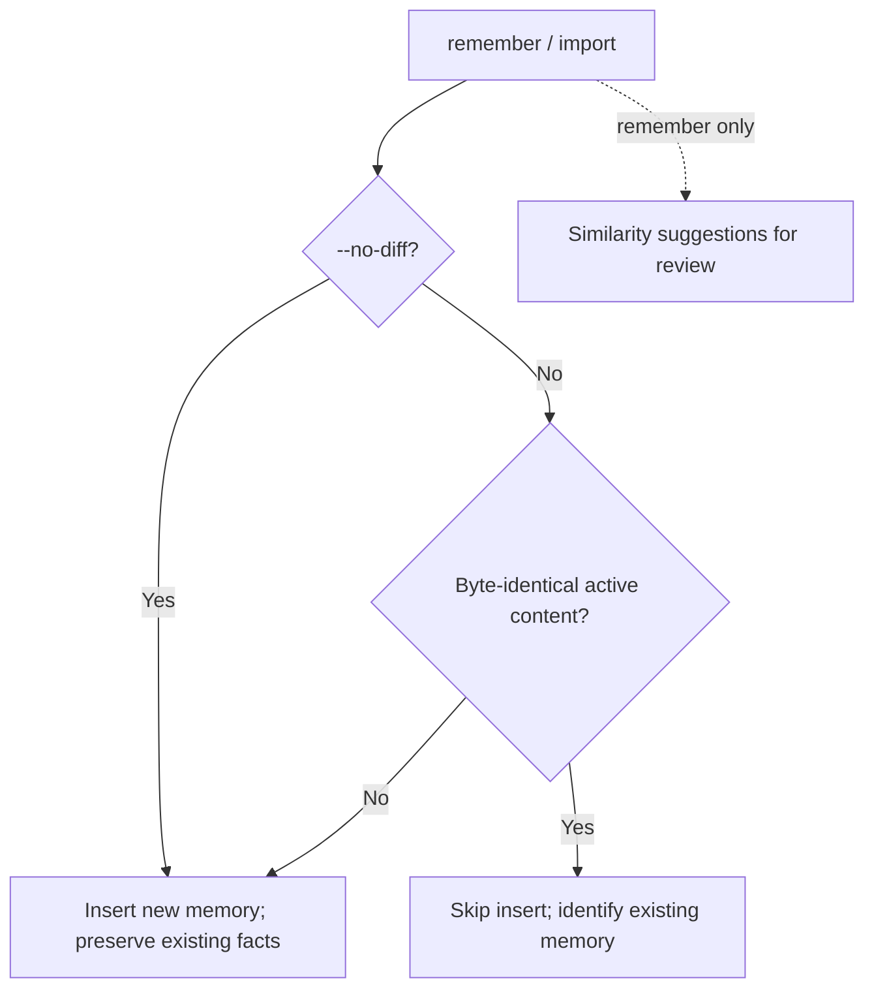

# 5. Read & Write Pipelines

[< Back to Design Overview](../DESIGN.md)

---

## 5.1 Write Pipeline: Remember

`mnemon remember` is the core command for writing memories. It includes a built-in diff step that automatically detects duplicates and conflicts before storage. The write transaction executes atomically within a single SQLite transaction.

### Detailed Flow

```
mnemon remember "Chose Qdrant as the vector database" \
  --cat decision --imp 5 --entities "Qdrant,Milvus"
```

**Step 1: Validate Input**
- Category must be one of the six types
- Importance 1-5
- Content must not exceed 8000 characters
- Up to 20 tags and 50 entities

**Step 2: Generate Embedding (outside transaction)**
- If Ollama is available: HTTP POST -> nomic-embed-text -> 768-dim float64 vector
- If unavailable: embedding = nil, falls back to token overlap downstream

**Step 2.5: Built-in Diff (outside transaction, read-only)**

Compute advisory similarity suggestions and check exact content against all active insights:
- **Byte-identical content** → skip insert, return `action="skipped"` and `diff_suggestion="DUPLICATE"`
- **Different content** → normal insert with `action="added"`, preserving the heuristic `diff_suggestion` for review

Similarity uses embedding cosine when available, falling back to token overlap.
Neither similarity nor extracted entities establish that one fact supersedes
another. Exact-content lookup is independent of similarity candidate limits.
The `--no-diff` flag disables both checks and inserts even exact repeats.

**Step 3: Atomic Transaction**

```
BEGIN TRANSACTION
  ① INSERT insight (UUID, content, category, importance, tags, entities, source)
  ② UPDATE embedding (if vector is available)
  ③ Graph Engine: OnInsightCreated
     ├── CreateTemporalEdge    → backbone + 24h proximity
     ├── CreateEntityEdges     → regex + dictionary extraction → co-occurrence links
     ├── CreateCausalEdges     → keywords + token overlap → auto causal edges
     └── CreateSemanticEdges   → cos >= 0.80 auto-link
  ④ RefreshEffectiveImportance → update EI decay values
  ⑤ AutoPrune                 → soft-delete lowest EI older than grace period
                                 + required per-ID oplog record
COMMIT
```

**Step 4: Candidate Output (post-transaction, read-only)**
- `FindSemanticCandidates`: Semantic candidates with cos in [0.40, 0.80)
- `FindCausalCandidates`: Causal candidates in the 2-hop BFS neighborhood

**Step 5: JSON Output**

```json
{
  "id": "abc-123",
  "action": "added",
  "diff_suggestion": "ADD",
  "edges_created": {"temporal": 2, "entity": 3, "causal": 1, "semantic": 1},
  "semantic_candidates": [
    {"id": "def-456", "content": "...", "cosine": 0.72, "auto_linked": false}
  ],
  "causal_candidates": [
    {"id": "ghi-789", "content": "...", "hop": 1, "suggested_sub_type": "causes"}
  ],
  "embedded": true,
  "effective_importance": 0.85,
  "auto_pruned": 0,
  "auto_pruned_ids": []
}
```

The `action` field is `"added"` (new entry) or `"skipped"` (byte-identical active
content, no insert). On a skipped repeat, the legacy `replaced_id` field names
the existing memory; it is not deleted or changed. A heuristic `UPDATE`,
`CONFLICT`, or near-`DUPLICATE` suggestion still produces `action="added"`.

After receiving this output, the LLM can evaluate candidates and establish edges it considers appropriate via the `mnemon link` command.

---

## 5.2 Read Pipeline: Smart Recall

`mnemon recall` is Mnemon's core retrieval algorithm. Smart recall is the default mode for all queries. It combines intent detection, multi-signal anchor selection, Beam Search graph traversal, and multi-factor re-ranking to achieve intent-aware graph-enhanced retrieval. Use `--basic` for legacy SQL LIKE fallback.


### Step 1: Intent Detection

Query intent is selected with a fixed set of local lexical patterns. The original
English/Chinese cues include:

| Intent | Trigger Patterns |
|--------|-----------------|
| WHY | `why`, `reason`, `because`, `cause`, `motivation`, `为什么`, `原因`, `理由` |
| WHEN | `when`, `time`, `before`, `after`, `timeline`, `什么时候`, `何时`, `时间` |
| ENTITY | `what is`, `who is`, `tell me about`, `是什么`, `谁是`, `关于` |
| GENERAL | None of the above match |

Question forms also cover Hindi, Spanish, Modern Standard Arabic, French,
Bengali, Portuguese, Indonesian, Russian, and German. See
[recall intent detection](../USAGE.md#recall-intent-detection) for supported
scripts, examples, and limits. Matching uses Unicode word boundaries for spaced
scripts. Conflicting cues involving an additional language fall back to GENERAL;
legacy English/Chinese-only queries retain keyword scoring and the ENTITY
tie-break. This is a bounded heuristic, not semantic language understanding.

`--intent WHY|WHEN|ENTITY|GENERAL` overrides detection in any query language.
The host can supply intent from the user's meaning without translating the query
or invoking another provider. `--verbose` exposes `meta.intent` and
`meta.intent_source` (`auto` or `override`).

### Step 2: Multi-Signal Anchor Selection (RRF Fusion)

Multiple signals run in parallel and are merged via Reciprocal Rank Fusion:

```
Signal 1: Keyword     → KeywordSearch(all_insights, query, top-20)
Signal 2: Vector      → CosineSimilarity(query_vec, all_embeddings, top-20)
Signal 3: Recency     → sort by created_at DESC, top-20
Signal 4: Entity      → insights sharing entities with the query

RRF Score = Σ  1 / (k + rank_i + 1)    (k = 60)
                 for each signal
```

Each insight may rank differently across signals; RRF fusion produces a robust composite ranking.

### Step 3: Beam Search Graph Traversal

Starting from each anchor, Beam Search is performed across the four graphs:

```
for each anchor:
    priority_queue = [(anchor, initial_score)]
    visited = {}

    while budget_remaining:
        node = pop(priority_queue)
        for edge in GetEdgesFrom(node):
            neighbor = edge.target
            structural_score = edge.weight × intent_weight[edge.type]
            semantic_score = cosine(vec_neighbor, vec_query)
            total = score_node + λ₁·structural + λ₂·semantic
            //  λ₁ = 1.0 (structural weight), λ₂ = 0.4 (semantic weight)

            if total > best_score[neighbor]:
                update(neighbor, total)
                push(priority_queue, neighbor)
```

**Adaptive parameters**:

| Intent | Beam Width | Max Depth | Max Visited |
|--------|-----------|-----------|-------------|
| WHY | 15 | 5 | 500 |
| WHEN | 10 | 5 | 400 |
| ENTITY | 10 | 4 | 400 |
| GENERAL | 10 | 4 | 500 |

WHY queries use a wider beam and deeper traversal because causal chains typically span multiple hops.

### Step 4: Multi-Factor Re-Ranking

For all collected candidates, a four-dimensional score is computed and combined via weighted sum:

```
keyword_score  = token_intersection / query_token_count
entity_score   = matched_entities / max(1, query_entities_count)
similarity     = cosine(vec_candidate, vec_query)
graph_score    = (traversal_score - min) / (max - min)   // min-max normalization

final = w_kw·keyword + w_ent·entity + w_sim·similarity + w_gr·graph
```

Weights vary by intent:

| Intent | Keyword | Entity | Similarity | Graph |
|--------|---------|--------|------------|-------|
| WHY | 0.10 | 0.10 | 0.30 | **0.50** |
| WHEN | 0.15 | 0.15 | 0.30 | **0.40** |
| ENTITY | 0.20 | **0.40** | 0.20 | 0.20 |
| GENERAL | 0.25 | 0.25 | 0.25 | 0.25 |

### Step 5: WHY Post-Processing — Causal Topological Sort

Equal relevance scores are ordered by importance, then newer creation time, then
ID. Keyword top-K selection uses the same tie order; vector, recency, and beam
ties use IDs. Anchor traversal and edge admission also use explicit ID order so
map iteration and SQLite scan order cannot change bounded candidate selection.

If the intent is WHY, an additional topological sort using Kahn's algorithm is performed: results are arranged along causal edges so that **causes come first, effects follow**. Equal-score nodes without causal precedence retain their prior ranking.

### Signal Transparency

Each retrieval result includes a detailed signal breakdown:

```json
{
  "insight": {"id": "...", "content": "..."},
  "score": 0.73,
  "intent": "ENTITY",
  "via": "keyword",
  "signals": {
    "keyword": 0.85,
    "entity": 0.60,
    "similarity": 0.72,
    "graph": 0.45
  }
}
```

This is a unique innovation in Mnemon: **exposing the retrieval pipeline's internal signals to the host LLM**. Since the host LLM has the full conversation context, it can make better re-ranking judgments than any algorithm inside the pipeline.

---

## 5.3 Deduplication & Conflict Detection: Diff



Diff is **built into `remember`** — no separate call needed. When `mnemon remember` is invoked, it automatically runs a diff check before inserting.

When `remember` is called, the built-in diff runs before the transaction:

1. Compute similarity against all active insights (embedding cosine when available, token overlap as fallback)
2. Independently scan all active insights for byte-identical content. Similarity
   suggestions describe possible relationships; exact equality alone permits a skip:

| Content | Diff suggestion | Behavior |
|---------|-----------------|----------|
| Byte-identical to an active memory | **DUPLICATE** | Skip insert, return `action="skipped"` |
| Different at any similarity | **ADD**, **UPDATE**, **CONFLICT**, or **DUPLICATE** | Insert with `action="added"`; retain the existing memory |

`import` uses the same exact-content lookup and preserves distinct content.
The `--no-diff` flag allows unconditional insertion on either command.
Capacity-based auto-pruning remains a separate lifecycle policy.

### Typical Workflow

Store new content, then retire a specific old fact only when appropriate:

```bash
# Diff suggestions are automatic and advisory
mnemon remember "Chose PostgreSQL to replace SQLite as the primary database" \
  --cat decision --imp 5 --source agent
# → Exact repeat: action="skipped"; existing memory unchanged
# → Different content: action="added"; existing memories retained

# If the new fact supersedes a specific old memory, verify before retiring it
mnemon show <new-id>
mnemon forget <old-id>
```
